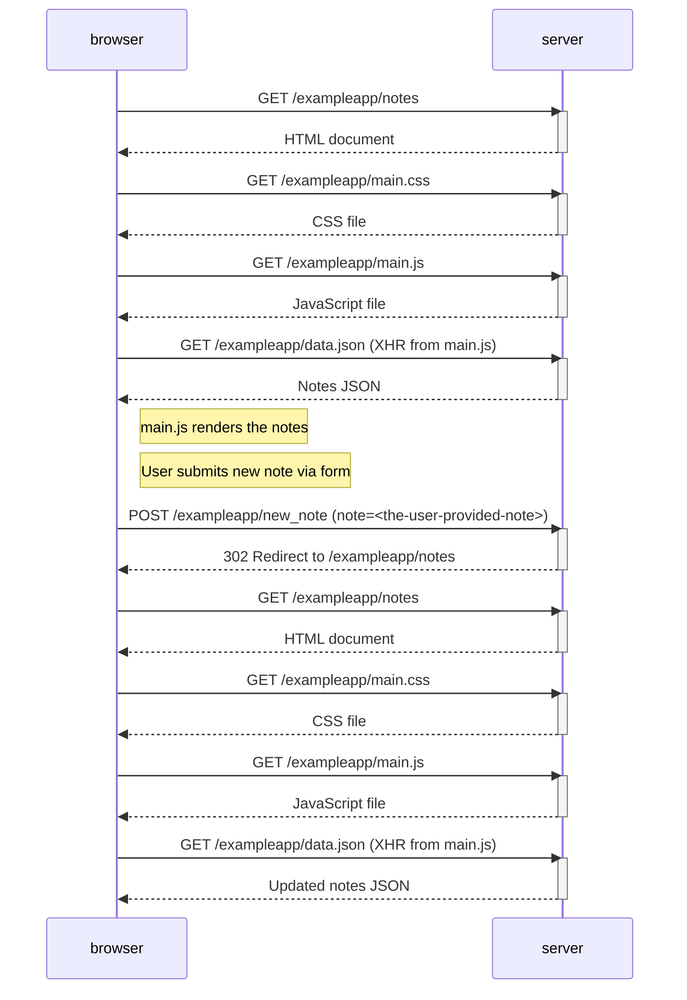

## Diagrams

You can use your browser's developer tools to export network traffic as a HAR file, making it easy to process programmatically.

## 0.4: New note diagram

User opens https://studies.cs.helsinki.fi/exampleapp/notes, creates a new note and submits it.

> **Note:** This diagram demonstrates the [**Post/Redirect/Get**](https://en.wikipedia.org/wiki/Post/Redirect/Get) pattern.

